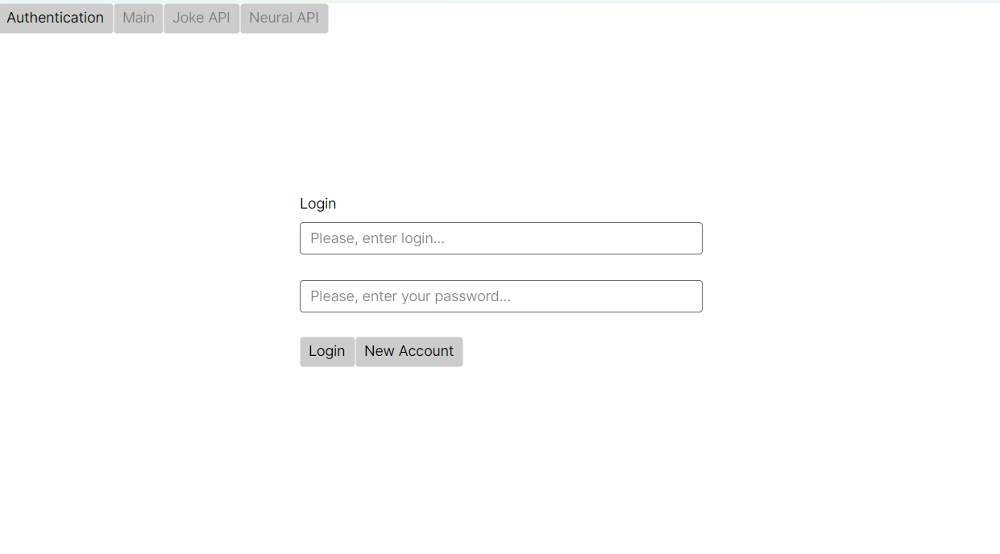
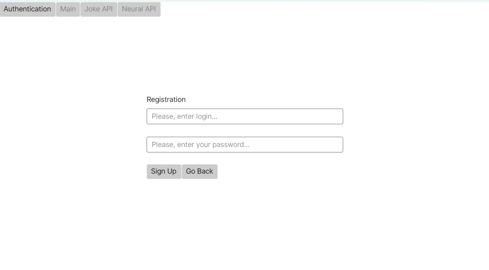
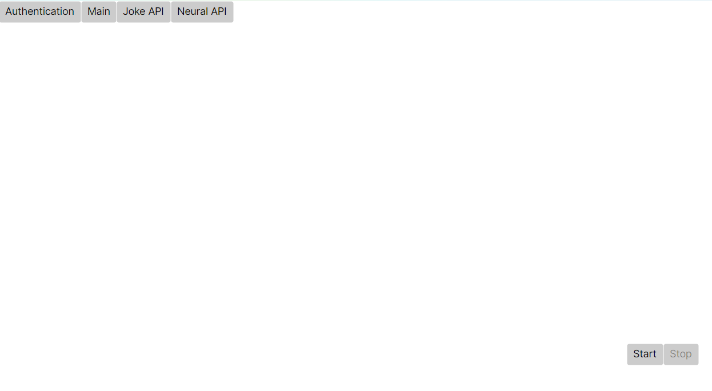
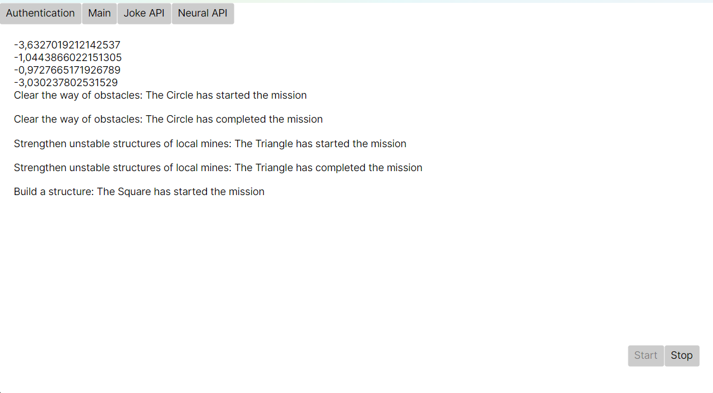
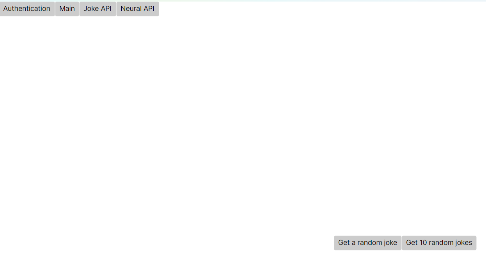
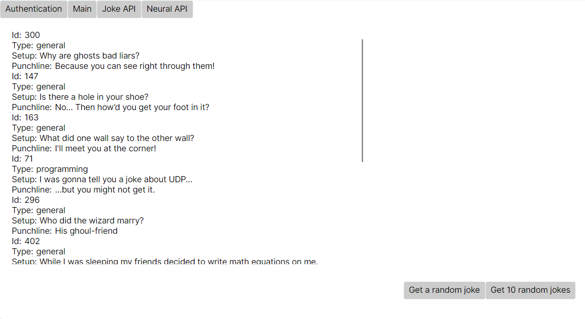
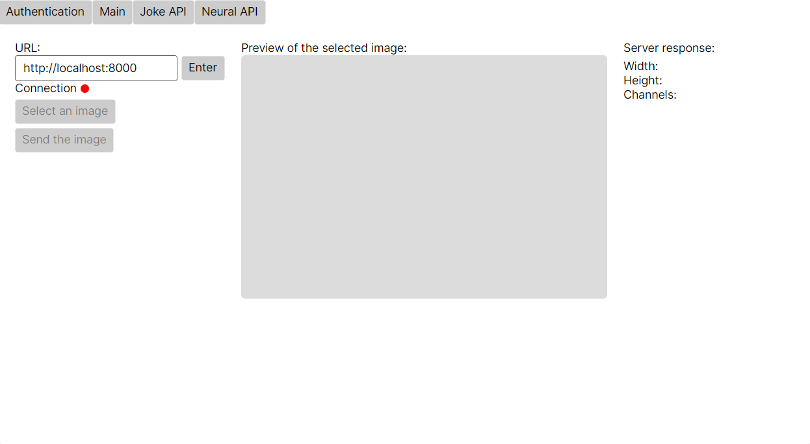
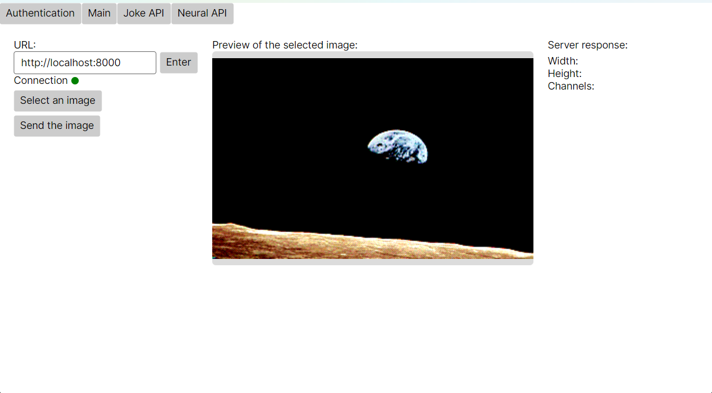
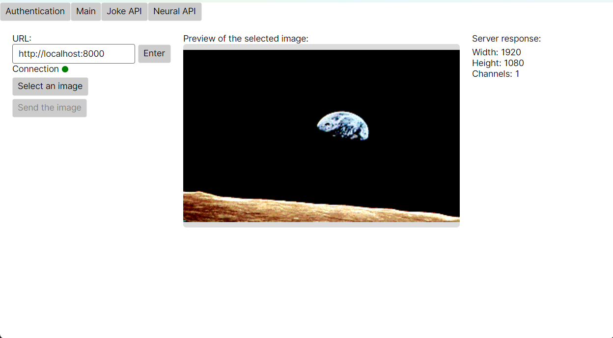

# Руководство пользователя

## Аутентификация
Разделу аутентификации соотвествует кнопка `Authentication` в верхнем меню разделов.

Для получения доступа к основному функционалу приложения необходимо пройти аутентификацию.

 *Раздел входа в систему*

`Login` - войти в систему. При успешном вводе логина и пароля в текстовые поля, осуществится автоматический переход к разделу модели предметной области; при возникновении ошибок будет выведено соответсвующее уведомление *(пустые поля ввода; неправильный ввод пароля или логина)*.

`New Account` - при нажатии осуществляется переход к разделу регистрации.

 *Раздел регистрации*

`Sign Up` - создать аккаунт с указанным логином и паролем. При возникновении ошибок будет так же выведено соотвествующее уведомление *(пустые поля ввода; наличие аккаунта с указанным логином в базе данных)*. После успешного создания аккаунта будет осуществлен автоматический переход к разделу входа в систему.

`Go Back` - перейти к разделу входа в систему.

## Модель предметной области "Королевство фигур"
Разделу с моделью предметной области соответсвует кнопка `Main` в верхнем меню разделов

 *Раздел модели предметной области "Королевство фигур"*

`Start` - при нажатии осуществляется запуск модели предметной области, которая отображается в левой части экрана.

 *Запуск модели предметной области*

`Stop` - кнопка доступна после запуска модели, при нажатии останавливает выполнение.

## Official Joke API
Разделу с функционалом для взаимодействия с Official Joke API соотвествует кнопка `Joke API` в верхнем меню разделов.

 *Раздел Official Joke API*

`Get a random joke` - отправка запроса API для получения случайной шутки. Ответ API отображается в левой части экрана.

`Get 10 random jokes` - отправка запроса API для получения 10 cлучайных шуток. Ответ API отображается так же в левой части экрана.

 *Ответ Official Joke API*

## API нейросетевого сервиса
Разделу с функционалом для взаимодействия c API нейросетевого сервиса соответсвует кнопка `Neural API` в верхнем меню разделов.

 *Раздел API нейросетевого сервиса*

Для подключения к API необходимо указать его URL *(по умолчанию - http://localhost:8000)* в соотвествующее поле и нажать `Enter`. При успешном подключении индикатор **Connection** под полем для ввода URL станет зеленым. При потере соединения индикатор станет красным, если соединение восстановится - то снова зеленым

`Select an image` - выбор файла изображения для последующего его использования в запросе к API *(доступно при наличии соединения с API)*. При успешном выборе файла, превью изображения будет отображено в центральном поле.

 *Отображение превью выбранного изображения*

`Send the image` - отправка выбранного изображения в нейросетевой сервис и получения ответа *(доступно при наличии выбранного изображения и соединения с API)*. Ответ API при успешной отправке отображается в правой части раздела.

 *Отображение ответа API*

[def]: #аутентификация
